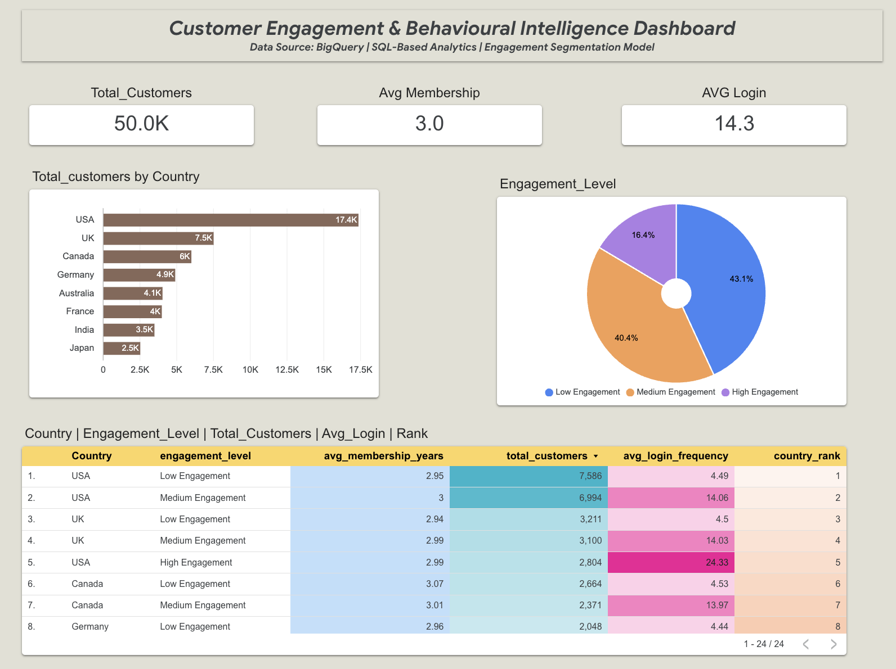

## Project Architecture

The project follows a structured analytics workflow:

1. **Data Source**
   - Raw customer behavior dataset imported into Google BigQuery

2. **Data Processing**
   - Data cleaning and transformation using SQL
   - Derived fields for engagement segmentation
   - Aggregations and grouping for behavioral analysis

3. **Analytics Layer**
   - Customer distribution analysis
   - Engagement segmentation (High / Medium / Low)
   - Ranking using Window Functions
   - Long-term customer identification
   - Regional engagement comparison

4. **Visualization**
   - Query outputs visualized using charts and tables
   - Screenshots added for result interpretation

5. **Business Insights**
   - Engagement-driven customer behavior understanding
   - Identification of high-value and low-engagement users
   - Regional performance comparison

---

## 📈 Analytical Approach

The analysis was performed using:

- Aggregation & Grouping  
- Window Functions (ROW_NUMBER)  
- Behavioral Segmentation  
- Percentage Distribution using analytic functions  
- Business-driven interpretation of data  

This approach ensures both **technical depth** and **business relevance**.

---
---

## 🖥 Executive Customer Engagement Dashboard

An interactive Business Intelligence dashboard built using **Google Looker Studio** on top of structured SQL queries executed in BigQuery.

### 🔗 Live Interactive Dashboard  
👉 Open in new tab (Right-click → Open link in new tab)

https://lookerstudio.google.com/reporting/5278ddb2-9b8a-4d2d-a904-a2684f4183cd

---

### 📊 Dashboard Preview

---

### 📈 Key Dashboard Components

- KPI Cards (Total Customers, Avg Login Frequency, Avg Membership Years)
- Top 10 Countries by Customer Base
- Engagement Segmentation (High / Medium / Low)
- Country-Level Performance Table
- Pivot Analysis (Country vs Engagement Level)
- Ranking of Countries by Customer Contribution

---

### 🎯 Business Value Delivered

- Identifies high-engagement customer segments
- Detects low-engagement users for retention strategies
- Highlights regional performance differences
- Supports data-driven decision-making for growth strategy

---
