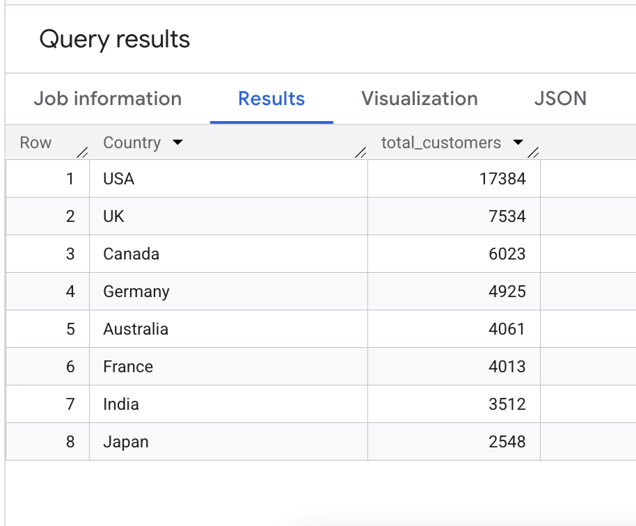
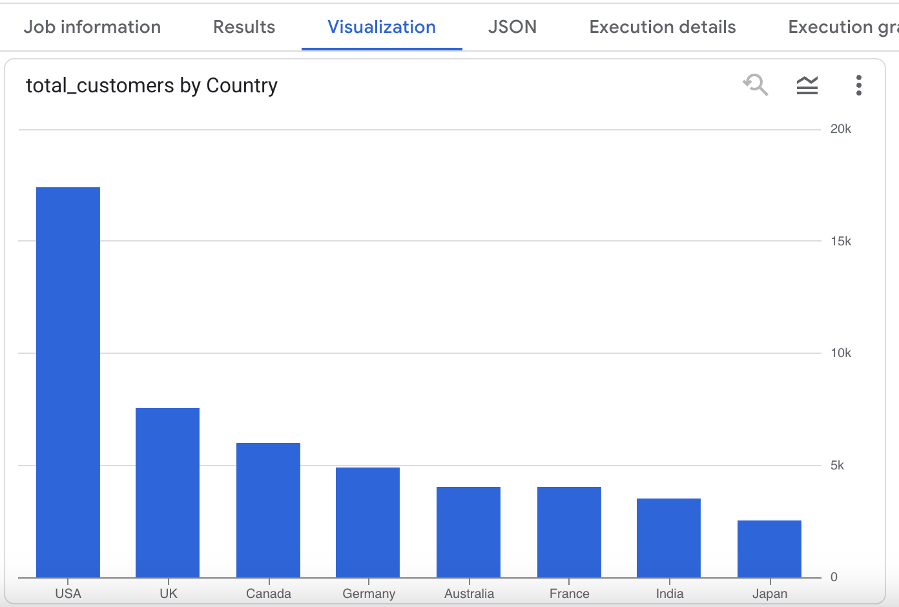
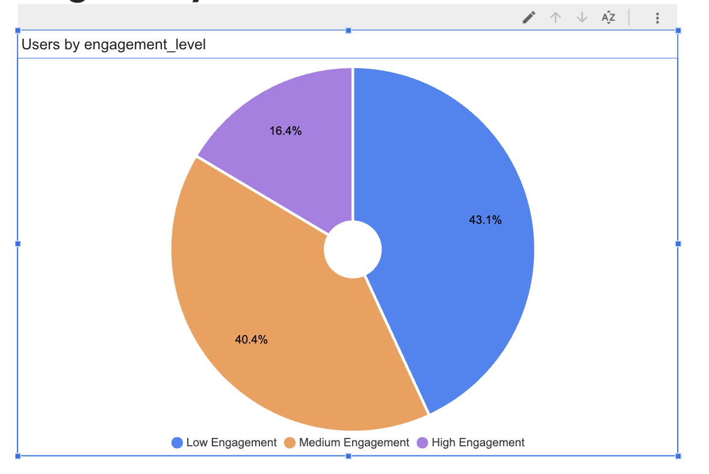
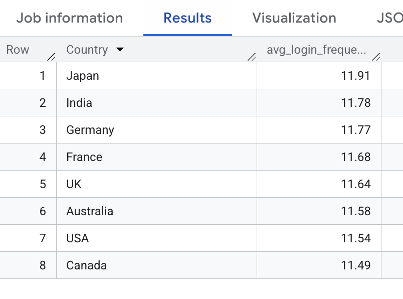

# 📊 Customer Behavior & Engagement Analysis (SQL)

---

## 📌 Project Overview

This project analyzes customer behavior and engagement patterns using SQL on a real-world dataset. The objective is to derive actionable business insights such as customer distribution, engagement segmentation, and long-term user behavior to support data-driven decision making.

---

## 🎯 Business Objective

Organizations often struggle to understand customer engagement and retention patterns. This analysis helps identify:

- Customer distribution across countries  
- Engagement level of users  
- High-value long-term customers  
- Behavioral segmentation for strategic targeting  

---

## 🛠 Tools & Technologies

- SQL (Google BigQuery)  
- Window Functions  
- Aggregations & Grouping  
- Data Segmentation Techniques  

---

## 📂 Dataset

**Customer Behavior Dataset**

### Key Fields Used:

- Country  
- Gender  
- Age  
- Membership_Years  
- Login_Frequency  

---

## 📊 Key Analysis Performed

### 1️⃣ Customer Distribution by Country  
Identified regions with highest customer concentration.

### 2️⃣ Average Membership Duration  
Measured customer loyalty and long-term retention trends.

### 3️⃣ Engagement Segmentation  
Customers classified into:
- High Engagement  
- Medium Engagement  
- Low Engagement  

Based on login frequency behavior.

### 4️⃣ Top Engaged Customers  
Identified most active users based on login frequency.

### 5️⃣ Customer Ranking (Window Function)  
Ranked customers by engagement level using SQL window functions.

### 6️⃣ Engagement by Country  
Compared average login frequency across different countries.

### 7️⃣ Engagement Segmentation with Percentage  
Calculated percentage distribution of engagement groups.

### 8️⃣ Long-Term Customers  
Identified customers with membership longer than 3 years.

---

## 🔍 Key Insights

- Certain countries show significantly higher customer concentration.  
- High engagement users represent the core active customer base.  
- Long-term customers tend to have higher engagement frequency.  
- Engagement varies significantly across regions, indicating targeted strategy opportunities.  

---

## 💼 Business Impact

This analysis enables businesses to:

- Identify highly engaged users for retention strategies  
- Target low-engagement users for reactivation campaigns  
- Understand regional engagement behavior  
- Improve customer lifecycle management  

---

## 👨‍💻 Author

**Vikas Jangra**  
Senior Data Analyst | SQL • Power BI • Python | Business Intelligence & Analytics  

## 📊 Project Output

### SQL Result

### Chart Visualization

## 📌 Business Insights

- Country X has the highest customer base, indicating strong regional penetration.
- High engagement users form the core active customer segment.
- Medium engagement users present upselling opportunities.
- Login frequency strongly correlates with membership duration.
- Long-term customers show higher platform interaction.

## 🎯 Strategic Recommendations

- Target low engagement users with retention campaigns.
- Focus marketing on high-performing countries.
- Design loyalty programs for long-term members.
- Build targeted engagement programs for medium-tier users.
